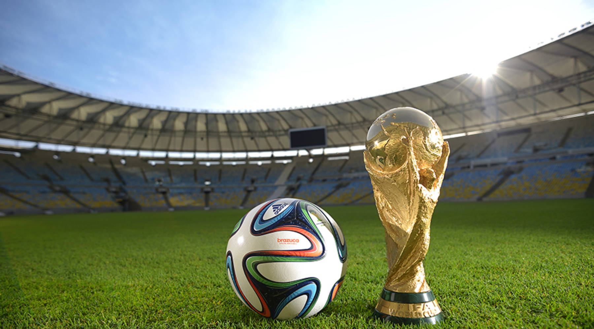

<style type="text/css">

body{ /* Normal  */
      font-size: 14px;
  }
td {  /* Table  */
  font-size: 12px;
}
h1.title {
  font-size: 42px;
  font-weight: bold;
  text-align: center;
  color: #226d8c;
  opacity: 0.8;
}
h4.author { 
  font-size: 20px;
  color: #226d8c;
  text-align: center;
}
h4.date { 
  font-size: 15px;
  font-family: "Times New Roman", Times, serif;
  color: DarkRed;
  text-align: center;
}
h1 { /* Header 1 */
  font-size: 28px;
  color: Black;
  font-weight: bold;
}
h2 { /* Header 2 */
    font-size: 22px;
  color: Black;
  font-weight: bold
}
h3 { /* Header 3 */
  font-size: 18px;
  color: Black;
  font-weight: bold
}

</style>


```{r setup, include = FALSE}
# Set the default mode for all the chunks
knitr::opts_chunk$set(message = FALSE, warning = FALSE, fig.align = "center", 
                      fig.height = 8, fig.width = 8)
```

# Introduction

## Motivation

**Why football?**

Football or soccer is ranked number 1 in the top 10 list of the World's most popular sport with approximately 3.5 billion fans according to [Top-end Sports](https://www.topendsports.com/world/lists/popular-sport/fans.htm). There are numerous champions and competitions for football globally. Among those, [FIFA](https://www.fifa.com/tournaments/mens/worldcup/qatar2022) World Cup is the most prestigious tournament in the world. Every four years, there are 32 nations with soccer male teams competing for the champion cups. Started in 1930, World Cup is one of the most influential sports events, where the whole world's eyes are keeping on.  




**What to expect from this report?** 

Inspired by the lively and enthusiastic vibes of the World Cup, the study attempts to investigate past data to visualize interesting rankings, trends and patterns on nations, players, attendance, host countries and goals. Since data visualization is the focus, we want to walk you through our meaningful graphs and to tell you an insightful story through our analysis. 

## Methodology

The methodology is described as follows:

1.	Obtain, and learn the data features
2.	Clean and prepare the data
3.	Make summary statistics and exploratory analysis
4.	Visualize various graphs
4. Visualize various graphs
   + Associate variables to investigate trend/pattern 
   + Diagnose the messages from the visualizations 
   + Form the most illuminating indicators
5.	Structure the report
6.	Choose the appropriate chart types
7.	Build a story through data visualization
8.	Describe, analyze, and discuss the findings from charts
9.	Build the model for estimating
10.	Write and finish up the report

The author attempts to write codes mainly in the consistent tidyverse style with dplyr and ggplot2. Some plots are coded with ggplotly to bring more interaction to the readers, and they can discover more detail of each data point in the tooltip. 

## Load packages and data

```{r data}
# Load packages and csv file
library(dplyr)
library(ggplot2)
library(tidyverse)
library(scales)
library(gridExtra)
library(tidyr)
library(readr)
library(knitr)
library(lintr)
library(janitor)
library(Hmisc)
library(patchwork)
library(wordcloud)
# library(wordcloud2)
library(RColorBrewer)
library(tm)
library(ggridges)
library(ggpol)
library(conflicted)
library(reshape2)
library(hrbrthemes)
# library(ggmap)
# library(maps)
# library(mapdata)
library(ggalluvial)
library(PerformanceAnalytics)
library(scales)
library(waffle)
library(plotly)

# Set conflict preference
conflict_prefer("filter", "dplyr")
conflict_prefer("select", "dplyr")

# Load and read csv files
cups <- read_csv("dataset/WorldCups.csv")

matches <- read_csv("dataset/WorldCupMatches.csv") %>% 
  # Remove empty rows
  filter(!is.na(Year))

players <- read_csv("dataset/WorldCupPlayers.csv")
```


## Dataset

There are three data sets from 1930-2014, and each of them is described as follows:

* `cups`: winners, runners-up, third and fourth positions
* `matches`: details of matches such as stadium, date, year, city, home team goals, away team goals, halftime goals, attendance, etc.
* `players`: players that play in each match

In the next chapter, the author will display the information and various visualizations about the nations in World Cup. To stay clear, the finding will be presented in the sequence of the three data sets as above. Besides, we show how we approach the data. The readers can discover the fascinating trends through the Exploratory Data Analysis (EDA) step by step. The data were downloaded from the following source: <https://www.kaggle.com/abecklas/fifa-world-cup>


## Set the theme for plots 

```{r set-up-theme-for-ggplot}
my_theme_general <- theme_minimal() +
  theme(
    plot.title = element_text(hjust = 0.5, face = "bold"),
        text = element_text(size = 10, color = "#495057"),
        panel.grid.major = element_line(linetype = "dashed"),
        panel.grid.minor = element_blank()
    ) 

my_theme_bar_chart <- theme_minimal() +
  theme(
    plot.title = element_text(hjust = 0.5, face = "bold"),
        plot.subtitle = element_text(hjust = 0.5),
        text = element_text(size = 10, color = "#495057"),
        panel.grid.minor = element_blank(),
        panel.grid.major.x = element_line(linetype = "dashed"),
        panel.grid.major.y = element_blank()
    )

my_theme_heat_map <-  theme_minimal() +
  theme(
    plot.title = element_text(hjust = 0.5, face = "bold"),
    text = element_text(size = 10, color = "#495057"),
    axis.text.x = element_text(angle = 90, vjust = 0.5, hjust=1)
    )

my_blank_theme <- theme_minimal()+
  theme(
  axis.title.x = element_blank(),
  axis.title.y = element_blank(),
  panel.border = element_blank(),
  panel.grid=element_blank(),
  axis.ticks = element_blank(),
  plot.title=element_text(size=14, face="bold")
  )
```


# Cups

Under this chapter, all the analyses are based on the first data set: `cups`. First, let's have a glimpse at the data:
```{r glimpse-cups}
# Glimpse at the data
glimpse(cups)
```


## Data cleaning

To briefly explain, we first change all column names from upper cases with space to lower cases and underscore. Afterward, the variable `attendance` with "." It is recognized as the character; hence, we remove the point and transform it as numerical. Next, Germany appeared as Germany and Germany FR due to the war, we decided to encode to one value "Germany". 

```{r clean-data-cups}
# Clean the column names
cups <- cups %>%  
  clean_names()

# Convert attendance from chr to numeric
cups <- cups %>% 
  ## Remove the "." in number because it define as chr, important to add "\\" 
  mutate(attendance = str_remove_all(attendance, "\\."),
         attendance = as.numeric(attendance)) 

# Change the value Germany FR to Germany 
cups <- cups %>% 
  mutate_at(
    vars(winner, runners_up, third, fourth), 
            list(~ ifelse(. == "Germany FR", "Germany", .))
  )
```


## Attendance and goal score by year

```{r overview-attenance-goal-year, fig.height = 8}
# Extract list of host countries won
host_won <- cups %>% 
  select(year, country, winner) %>% 
  filter(country == winner) 

# Line chart over the year country attendance
plot1 <- cups %>% 
  ggplot(aes(x = year, y = attendance)) +
  geom_text((aes(label = country)), size = 2.5, vjust = -2, hjust = 1) +
  geom_point(size = 5, color = "#e1856e") +
  geom_line() +
  ## add vertical line to show the host countries who won
  geom_vline(data = host_won, aes(xintercept = year), 
              size = 1, color = "#52b788") +
  scale_x_continuous(breaks = seq(1930, 2014, 4)) +
  scale_y_continuous(limits = c(0, 4000000)) +
  labs(title = "Attendance in World Cup") + 
  guides(col=guide_legend("Host country")) +
  my_theme_general 

# To make the label not overlap
library(ggrepel)

# Line chart over the year country attendance
plot2 <- cups %>% 
  ggplot(aes(x = year, y = goals_scored)) +
  # geom_text((aes(label = country)), size = 2.5, vjust = -2, hjust = 1) +
  geom_point(size = 5, color = "#e1856e") +
  geom_line() +
  geom_text_repel((aes(label = country)), size = 2.5) +
  ## add vertical line to show the host countries who won
  geom_vline(data = host_won, aes(xintercept = year), 
             size = 1, color = "#52b788") +
  scale_x_continuous(breaks = seq(1930, 2014, 4)) +
  scale_y_continuous(limits = c(0, 200)) +
  labs(title = "Goals score in World Cup") + 
  guides(col=guide_legend("Host country")) +
  my_theme_general

# Put two line chart in one frame
grid.arrange(plot1, plot2, ncol = 1, nrow = 2)
```

Each point in the graph above displays the host country. The y axis presents the number of attendances on the upper plot and the number of scored goals on the lower chart. The vertical straight green lines indicate the host also won in that year. Interestingly, five nations organized the World Cup and won at the same time are Uruguay, Italy, England, Germany, Argentina, and France in 1998. The goals surged dramatically in 1954, 1982, 1998, and 2014. 

## Played matches and qualified teams

```{r played-matches-qualified-teams-way1, include = FALSE}
## Way 1: Bar and line charts 
cups %>% 
  ggplot(aes(x = as.factor(year))) +
  geom_col(aes(y = matches_played), fill = "#57a896", alpha = 0.8) +
  geom_text(aes(label = matches_played, y = matches_played), 
            size = 3, hjust = 0.6, vjust = -0.8) +  
  geom_point(aes(y = qualified_teams), size = 4, color = "#e1856e") + 
  geom_text(aes(label = qualified_teams, y = qualified_teams), 
            size = 3, hjust = 0.6, vjust = 2) +  
  geom_line(aes(x = as.factor(year), y = qualified_teams), 
            group = 1, size = 1.5, alpha = 0.8, color = "#e1856e") +
  my_theme_general +
  theme(panel.grid.major.x = element_blank())
```


```{r played-matches-qualified-teams-way2, fig.height = 7}
# Compare matches played vs qualified team over the years
## Way 2: Two line charts
### Create a data frame of long format for matches and teams
d_matches_played_qualified_team <- cups %>% 
  select(year, matches_played, qualified_teams) %>% 
  pivot_longer(-year, 
               names_to = "matches_teams",
               values_to = "value")

### Two line charts
d_matches_played_qualified_team %>% 
  ggplot(aes(x = as.factor(year), y = value,
             group = matches_teams, 
             color = matches_teams, 
             shape = matches_teams)) +
  geom_line(size = 1.5, alpha = 0.6) +
  geom_point(size = 4.5) +
  geom_text(aes(label = value, y = value), 
            color = "#495057", size = 3, hjust = 1, vjust = -2) +  
  scale_color_manual(values = c("#e1856e", "#57a896")) +
  labs(x = "year", y = "number") +
  my_theme_general +
  theme(legend.title = element_blank(),
        panel.grid.minor.y = element_line(linetype = "dashed"))
```

The orange line displays the matches, and the green line shows the qualified teams. Both games and qualified teams have been generally rose over the years. 

## Total goals versus average goals


```{r total-goals-vs-average-goals, fig.height = 6}
# Create a new column for average goals
cups <- cups %>% 
  mutate(average_goals = goals_scored / matches_played)

# Total vs average goals by year
d_total_vs_average_goals <- cups %>% 
  select(year, goals_scored, average_goals) %>% 
  ## To plot gglot 2 lines better
  pivot_longer(-year, 
               names_to = "total_vs_average_goals", 
               values_to = "value")

# Two lines in one plot to compare
plot_toal_average_goals <- d_total_vs_average_goals %>% 
  ggplot(aes(x = year, y = value, 
             group = total_vs_average_goals, 
             color = total_vs_average_goals)) +
  geom_line(size = 1.5) +
  geom_point(size = 4.5) +
  scale_x_continuous(breaks = seq(1930, 2014, 4)) +
  scale_y_continuous(limits = c(0, 180)) +
  scale_color_manual(values = c("#bd4d4f", "#57a896")) +
  my_theme_general +
  theme(legend.title = element_blank(),
        panel.grid.minor.y = element_line(linetype = "dashed"))
  
plot_toal_average_goals
```

To achieve this graph, we insert a column average_goals to the data by taking the goals_score dividing the number of teams. The chart below exhibits a captivating trend. While the total score (as the green line) seems to fluctuate and increase for years, the average goals (as the red line) tend to slightly decrease. We will explain more in detail in the next chapter.

## Podium 

From the 4 columns `winner`, `runners_up`, `third`, `fourth`, we must extract the data and created a data frame to show how many times each country successfully got into the final and semi-final rounds. 

```{r cups-podium-dataframe}
# Winner, runner-up, third & fourth
d_winner <- cups %>% 
  count(winner, sort = TRUE) %>% 
  rename(country = winner, 
         n_winner = n)

d_runners_up <- cups %>% 
  count(runners_up, sort = TRUE) %>% 
  rename(country = runners_up, 
         n_runners_up = n)

d_third <- cups %>% 
  count(third, sort = TRUE) %>% 
  rename(country = third, 
         n_third = n)

d_fourth <- cups %>% 
  count(fourth, sort = TRUE) %>% 
  rename(country = fourth, 
         n_fourth = n)

# Full join data frame together
d_semi_final_country <- d_winner %>%  
  full_join(d_runners_up, by = "country") %>% 
  full_join(d_third, by = "country") %>% 
  full_join(d_fourth, by = "country") %>% 
  ## Pivot long
  pivot_longer(cols = c(n_winner, n_runners_up, n_third, n_fourth)) %>% 
  ## Mutate NA to 0
  mutate(value = ifelse(is.na(value), 0, value)) %>% 
  rename(count = value,
         position = name)
```

### Top 2 podium


```{r top-2-final-podium}
# Extract winner and runners-up
d_top_2 <- d_semi_final_country %>% 
  filter(position %in% c("n_winner", "n_runners_up"))

# Sankey diagram top 2 countries
ggplot(as.data.frame(d_top_2),
       aes(y = count, axis1 = country, axis2 = position)) +
  geom_alluvium(aes(fill = position), width = 1/10) +
  geom_stratum(width = 1/10, fill = "#006463", color = "white") +
  geom_label(stat = "stratum", aes(label = after_stat(stratum))) +
  scale_x_discrete(limits = c("country", "postition in final"), 
                   expand = c(.05, .05)) +
  scale_fill_brewer(type = "qual", palette = "Dark2") +
  ggtitle("Semi-final countries") +
  my_blank_theme +
  theme(panel.grid.major.x = element_blank(),
        axis.title.y = element_blank(),
        axis.text.y = element_blank(),
        axis.ticks.y = element_blank())
```

The Sankey graph shows the runner-up and winners from several countries. The bigger the flow, the more that country won or being runner up. 

### Top 4 podium


```{r wordcloud-podium, fig.height = 6}
# Create a data frame to count times that each country in the semi-final
d_podium_wordcloud <- d_winner %>%  
  full_join(d_runners_up, by = "country") %>% 
  full_join(d_third, by = "country") %>% 
  full_join(d_fourth, by = "country") %>% 
  mutate_all(~replace(., is.na(.), 0)) %>% 
  mutate(total = n_winner + n_runners_up + n_third + n_fourth) 

# Word cloud showing nation name by the times in the semi-final
wordcloud(words = d_podium_wordcloud$country,  
          freq = d_podium_wordcloud$total,
          min.freq = 1,
          random.order = FALSE,
          scale=c(8,.2),
          colors = brewer.pal(8, "Dark2"))
```


The word cloud gives an impression that the countries made it to the top four podia. Notably, the size of the word demonstrates the total number of times they got into the semi-finals. German, Brazil, and Italy are the three most prominent words, meaning that they have most times as the four most successful teams in history. 


```{r wordcloud2-podium, fig.height = 6, include = FALSE}
# Word cloud 2
# d_podium_wordcloud %>% 
#   select(country, total) %>% 
#   wordcloud2(color='random-dark', shuffle = FALSE)
```


```{r stack-bar-semi-finals, fig.height = 6}
# Stack bar chart semi-finals
ggplot(d_semi_final_country, aes(x = reorder(country, count), 
                                 y = count, fill = position)) +
  geom_col(position = position_stack(), width = 0.7) +
  geom_text(aes(label = ifelse(count == 0, "", count)), 
            position = position_stack(vjust = 0.5),
            color = "white", size = 3) +
  labs(x = "country") +
  coord_flip() +
  scale_fill_manual(values = c('#30867b', '#83cab8', '#e1856e', '#bd4d4f')) +
  my_theme_bar_chart 
```

The stack bar chart with colors, implying the four positions in the semi-finals. On the y-axis, the country names are demonstrated. Overall, 24 countries ever achieved the World Cup's top four. Moreover, the white label on each bar presents the number of times the country got the corresponding position. For example, Germany stays on top with 4 times as the winner, 4 times as the runner up, 4 times as the third, and 1 time as the fourth place. However, Brazil leads 5 times as the winner.  

# Matches
Let's move to the following dataset: `matches`

```{r glimpse-matches}
glimpse(matches)
```

## Data cleaning

In the data set 'matches', we modify the column date to the proper format. Besides, in `the home_team_name` and `away_team_name`, it's essential to remove "rn\">" before the country names. 

```{r prepare-data-matches}
# Clean the column names
matches <- matches %>%  
  clean_names()

# Separate datetime to 2 columns: date and time
matches <- matches %>% 
  separate(datetime, into = c("date", "time"), sep = "-") %>%
  ## There is space before and after the chr, str_trim remove space
  mutate(date = str_trim(date), 
         time = str_trim(time))

# Make the date column become date format
matches <- matches %>%  
  ## Change some June and Jul to same month format
  mutate(date = str_replace_all(date, c("June" = "Jun", 
                                        "July" = "Jul")), 
         date = parse_date(date, format = "%d %b %Y"))

# Make the time column become time format
matches <- matches %>%  
  mutate(time = parse_time(time))

# Remove unicode replacement character from attendance
matches <- matches %>% 
  ## Convert a character vector between encodings
  mutate(stadium = iconv(stadium, mark = FALSE, sub = "<U+xxxx>")) %>% 
  ## "<U+xxxx>" become "¿½" -> Remove
  mutate(stadium = str_replace_all(stadium, "�", "a"))

# library(stringi)
# test <- matches %>% 
#   ## Convert a character vector between encodings
#   mutate(stadium = str_replace_all(stadium,"\\<U[^\\>]*\\>","")) 
#   ## "<U+xxxx>" become "¿½" -> Remove
#   #mutate(stadium = str_remove_all(stadium, "¿½"))
# unique(test$stadium)

# Remove rn\"> in the home_team_name and away_team_name
matches <- matches %>% 
  mutate(home_team_name = str_remove(home_team_name, "rn\">"),
         away_team_name = str_remove(away_team_name, "rn\">"))

# Change "Germany FR" and "German DR" to "Germany"
matches <- matches %>% 
  mutate(
    home_team_name = case_when(
      home_team_name %in% c("German DR", "Germany FR") ~ "Germany",
      TRUE ~ home_team_name),
    away_team_name = case_when(
      away_team_name %in% c("German DR", "Germany FR") ~ "Germany",
      TRUE ~ away_team_name),
      ) 
```

## Summary statistics

The five-number summary introduces the lower, upper quartiles, median, mean, min, and max numerical variables. The result shows that the mean of home team goals is 1.8 while the mean of away team goals is 1.02. A further examination needs to be conducted.  

```{r summary-statistics-matches}
# Overview summary statistics of the dataframe matches
summary(matches)
```

**Correlation matrix**

```{r corr-matrix}
# overview correlation matrix of all numerical variables
d_matches_numerical <- matches[, sapply(matches, is.numeric)] 
chart.Correlation(d_matches_numerical, histogram = TRUE, pch = 19)
```

In the above plot, the distribution of each variable is shown on the diagonal. On the bottom of the diagonal: the bivariate scatter plots with a fitted line are displayed. On the top of the diagonal: the value of the correlation plus the significance level as stars. Each significance level is associated to a symbol : p-values(0, 0.001, 0.01, 0.05, 0.1, 1) <=> symbols(“***”, “**”, “*”, “.”, " “). Some of the variables, such as `home_team_goals` and `half_time_home_goals`, are correlated. However, a pair of variable `year` and `match_id` does not make sense with a 0.64 correlation. The correlation matrix and the five-number summary statistics only provide an overview of all numerical features, a more detailed analysis will be presented later in this paper. 


## Attendances

Out of thousands of matches, which matches had the highest number of attendances? This question leads us to the flipped bar chart below:

```{r matches-stadium-city-attendance}
##### Top 20 matches attendances
d_matches_top20_attendances <- matches %>% 
  select(year, stadium, home_team_name, away_team_name, attendance) %>%
  mutate(team = paste0(home_team_name, " vs ", away_team_name, " ", year)) %>% 
  top_n(20, attendance)

# Flip bar chart top 20 matches attendances  
d_matches_top20_attendances %>% 
  ggplot(aes(x = reorder(team, attendance), y = attendance, 
             fill = stadium)) + 
  geom_col(width = 0.85) +
  geom_text(aes(label = attendance), 
            vjust = 0.5, hjust = -0.5, size = 2.5, color = "#343a40") +
  coord_flip() +
  labs(y = "attendance per match", x = "matches") +
  scale_y_continuous(limits = c(0, 200000)) +
  scale_fill_manual(values = c("#e1856e", "#30867b", "#bd4d4f")) +
  my_theme_bar_chart +
  theme(axis.title.x = element_text(hjust = 0.5))
```

The matches and the year are shown on the y-axis, while the attendance per match is presented on the x-axis. Moreover, the color for each bar displays the stadium name where the battles took place. As can be seen, the three stadiums that welcomed the highest number of audiences are Maracanã, Estadio, and Wembley. The matches reached the most enormous attendance number was in 1950, between Uruguay and Brazil, with 173,850 people. Remarkably, the top attendance matches were from the 50s to the 80s. 

```{r matches-top20-attendance-per-city}
# Top attendances per 20 cities 
d_cities_top20_attendance <- matches %>% 
  select(year, city, attendance) %>%
  group_by(city) %>% 
  mutate(max_attendance = max(attendance)) %>% 
  filter(attendance == max_attendance) %>% 
  arrange(desc(max_attendance)) %>% 
  ungroup() %>% 
  slice(1:30) %>% 
  distinct_all() 

# Flip bar chart top attendances per 20 cities  
d_cities_top20_attendance %>% 
  ggplot(aes(x = reorder(city, attendance), y = attendance)) + 
  geom_col(fill = "#30867b", width = 0.85) +
  geom_text(aes(label = attendance), 
            vjust = 0.5, hjust = -0.5, size = 2.5, color = "#343a40") +
  coord_flip() +
  labs(y = "attendance per match", x = "matches") +
  scale_y_continuous(limits = c(0, 200000)) +
  my_theme_bar_chart 
```

Next, we extract the top attendance per 20 cities. The plot indicates that Rio De Janeiro had a match with the highest attendances, followed by Mexico City, London, and Barcelona. 

## Home and away team result comparison

Before discussing this section, we would like to define the home team and away team terms. The home team in football is one of two teams in a football game that are given perks such as home-field advantage. The home team is decided by the schedule made at the beginning of the year, and each team plays half of their games as the home team and half as the away team, according to  [Rookieroad](https://www.rookieroad.com/football/glossary-of-terms/home-team/).

Therefore, it's essential to compare home and away team results.


```{r waffle-result-home-away-team, fig.height= 6}
# Create a column "result" with home/away team won or draw
matches <- matches %>% 
  mutate(result = case_when(home_team_goals > away_team_goals ~ "home team won",
                            home_team_goals < away_team_goals ~ "away team won",
                            home_team_goals == away_team_goals ~ "draw",
                            TRUE ~ "unknown"))

d_home_away_team_won <- matches %>% 
  select(home_team_name, away_team_name, home_team_goals, away_team_goals, result)

# Create data frame to count home-away team won
d_count_home_away__won <- d_home_away_team_won %>% 
  count(result, sort = TRUE)

# Extract result, perc for waffle chart home-away team won
d_home_away_team_won_perc <- d_home_away_team_won %>% 
  count(result, sort = TRUE) %>% 
  mutate(perc = n/sum(n) * 100) %>% 
  select(result, perc) 


# Waffle chart way 1 home-away team won
# ggplot(d_count_home_away__won, aes(fill = result, values = n)) +
#   geom_waffle(n_rows = 21, size = 0.33, colour = "white") +
#   scale_fill_manual(name = NULL,
#                     values = c("#bd4d4f", "#bce9e4", "#30867b"),
#                     labels = c("away team won 20.4%", "draw 22.3%", 
#                                "home team won 57.3%" )) +
#   coord_equal() +
#   theme_void()

# Waffle chart way 2 home-away team won
waffle(d_home_away_team_won_perc, rows = 9, 
       colors = c("#bd4d4f", "#bce9e4", "#30867b"),
       xlab = "home team won 57.3%, draw 22.3%, away team won 20.4%")
```

```{r matches-home-away-team-won,include = FALSE}
# Stack bar chart normalized result home-away team won 
ggplot(d_home_away_team_won_perc , aes(x="", y = perc, fill = result))+
  geom_col(position = position_stack(), width = 0.5) +
  scale_fill_manual(values=c("#bd4d4f", "#bce9e4", "#30867b")) +
  geom_text(aes(y = perc, label = paste0(round(perc), "%")),
           position = position_stack(vjust = 0.5), 
           size = 4, color = "white") +
  scale_x_discrete(expand = expansion(add=c(0,0))) +
  coord_flip() +
  theme_minimal() +
  theme(panel.grid = element_blank(),
        axis.title.y = element_blank(),
        legend.title = element_blank())
```

The result of the matches is divided into three categories based on the goals of home teams and away teams, namely 1) "home team won", 2) "draw", 3) "away team won". The waffle chart shows the proportion of these results out of all the matches: 57.3% matches won by home teams, 22.3% draw, and 20.4% matches won by away teams. 

## Home and away team goals comparison

After examining the results, we continue to explore the distribution of `away_teams_goals` and `home_team_goals`. 


```{r goal-ratio-home-away, fig.height = 2}
# Home & away team goals in year
d_home_away_team_goals <- matches %>% 
  select(year, home_team_goals, away_team_goals) %>% 
  pivot_longer(cols = c(home_team_goals, away_team_goals))

# Stacked bar goal ratio
d_home_away_team_goals %>% 
  group_by(name) %>%
  summarise(total = sum(value)) %>%
  ungroup() %>% 
  mutate(perc = total/sum(total) * 100) %>% 
  ggplot(aes(x = "", y = perc, fill = name))+
  geom_col(position = position_stack(),  width = 0.5) +
  geom_text(aes(y = perc, label = paste0(round(perc), "%")),
           position = position_stack(vjust = 0.5), 
           size = 4, color = "white") +
  scale_fill_manual(values=c("#ee6c4d", "#30867b")) +
  scale_x_discrete(expand = expansion(add=c(0,0))) +
  coord_flip() +
  theme_minimal() +
  theme(panel.grid = element_blank(), 
        legend.title = element_blank(), 
        axis.title.y = element_blank())
```

Over the total goals, home teams account for 64%, but the away teams only generate 36%. 


```{r jitter-plot}
# Jitter plot away team vs home team goals color by year
d_home_away_team_goals %>% 
  ggplot(aes(x = name, y = value)) +
  geom_boxplot() +
  geom_jitter(aes(color = as.factor(year)),
              alpha = 0.7, width = 0.15) +
  labs(x = "team", y = "number of goals") +
  scale_fill_brewer(type = "div", palette = "RdYlGn") +
  my_theme_general +
  theme() +
  theme(panel.grid.major.x = element_blank())
```


The jitter mixed box plot below illustrates the data point of goals distributed in each team category. The goal median for home teams is higher than the away teams. Moreover, the home_team_goals distribution seems to be more spread and have higher values. Each data point has a color of the year. However, there is no clear pattern by year in this graph. 


```{r density-plot}
# Density plot home vs away team goals
## 2 plots in one
plot_density_home_away_goals <- d_home_away_team_goals %>% 
  ggplot(aes(x = value, color = name, fill = name)) +
  geom_density(alpha = 0.5) +
  # ggridges::geom_density_ridges() +
  scale_fill_manual(values = c("#ee6c4d", "#30867b")) +
  scale_color_manual(values = c("#ee6c4d", "#30867b")) +
  labs(x = "number of goals", y = " ") +
  my_theme_general +
  theme(legend.title = element_blank())

## 3rd try 2 plots separately
plot_density_seperate_home_away_goals <- d_home_away_team_goals %>% 
  ggplot(aes(x = value, y = name, color = name, fill = name)) +
  # geom_density(alpha = 0.7) +
  ggridges::geom_density_ridges() +
  scale_fill_manual(values = c("#ee6c4d", "#30867b")) +
  scale_color_manual(values = c("#ee6c4d", "#30867b")) +
  labs(x = "number of goals", y = " ") +
  my_theme_general +
  theme(legend.title = element_blank())

## Combine them together
grid.arrange(plot_density_home_away_goals, 
             plot_density_seperate_home_away_goals)
```

The combined density plots below enable us to compare the home and away team goal distribution to make the comparison more visible. As can be seen, the goals of away teams mostly stay in the small number of goals with two high steep bumps, while the goals of home teams are broader and distributed with a long tail to the right. The home teams appear to achieve more goals than the away teams. 


## Home and away team goals by year


```{r matches-home-away-team-goals-comparision, fig.height = 10}
## Density home vs away goals by years
d_home_away_team_goals %>% 
  ggplot(aes(x = value, y = factor(year), color = name, fill = name)) +
  # geom_vline(xintercept = 0.5, size = 0.75, color = "#737373") +
  # stat_density_ridges(quantile_lines = TRUE, quantiles = 2) +
  ggridges::geom_density_ridges(alpha = 0.9, scale = 1.5) +
  scale_fill_manual(values = c("#ee6c4d", "#30867b")) +
  scale_color_manual(values = c("#ee6c4d", "#30867b")) +
  #scale_x_continuous(limits = c(0, 10))
  labs(x = "number of goals", y = "year") +
  my_theme_general +
  theme(legend.title = element_blank())
```


Following the prior analysis, we scrutinize further the distribution of goals by year. Several density plots provide the best view to observe the trend of home and away teams' goals in different years. From 1930 to 1970, there was a noticeable difference in the distribution of goals between home and away teams. The home teams in the past tended to have significantly more goals than the away teams. However, from 1986 to 2014, the distribution of the goals looks more similar among them. It means that the home teams do not get substantial goal achievements than the away teams.  Hence, playing as home teams or away teams makes much fewer variations nowadays compared to the past.

## Goals by country

The plot shows the total of goals made by each country. Germany, Brazil, Argentina, Italy, France, and Spain are the top 6 countries with the most goals. 

```{r matches-goals, fig.dim = c(6, 8)}
# Make a dataframe with all countries and total goals per country
d_goals_per_country <- matches %>% 
  select(home_team_name, home_team_goals, away_team_name, away_team_goals) %>% 
  pivot_longer(cols = c(home_team_name, away_team_name)) %>%
  ## Group the countries
  group_by(value) %>% 
  ## Summarise across columns and rows to calculate goals per country
  summarise(total_goals = sum(home_team_goals) + sum(away_team_goals)) %>% 
  ungroup() %>% 
  rename(country = value)

## Top 6 countries by goals
d_top_6_country_goals <- d_goals_per_country %>% 
  top_n(6, total_goals) %>% 
  arrange(-total_goals)

## Bar chart total goals by country
d_goals_per_country %>% 
  ggplot(aes(x = reorder(country, total_goals), y = total_goals)) +
  geom_col(width = 0.5, fill = "#30867b") +
  labs(x = "country", y = "goals") +
  coord_flip() + 
  my_theme_general 
```


```{r heatmap-goals-country, fig.height = 12}
# Make a dataframe goals per country per year
d_goals_per_country_per_year <- matches %>% 
  select(year, home_team_name, home_team_goals, away_team_name, away_team_goals) %>% 
  pivot_longer(cols = c(home_team_name, away_team_name)) %>%
  ## Group the countries
  group_by(year, value) %>% 
  ## Summarise across columns and rows to calculate goals per country
  summarise(total_goals = sum(home_team_goals) + sum(away_team_goals)) %>% 
  ungroup() %>% 
  rename(country = value)

## Heat map goals per country per year
d_goals_per_country_per_year %>% 
  ggplot(aes(x = as.factor(year), y = country, fill = total_goals)) + 
  geom_tile(color = "white", lwd = 1, linetype = 1) +
  coord_equal() +
  scale_fill_gradientn(
    breaks = seq(0, 50, 5),
    colours = c('#006463', '#30867b', '#57a896', '#83cab8', 
                '#fbc09c', '#e1856e', '#bd4d4f', '#93003a'),
    values = scales::rescale(seq(0, 800, 100))) +
  labs(x = "year") +
  my_theme_heat_map
```

The previous graph brings us to analyze further the total goals of each country by different years. The color implies the goal number made in the coordination of a country at a year. For instance, some red boxes present the country with more than 40 goals at one championship. Hungary and Germany made many goals in 1954, whereas France had their glorious time in 1962, and Brazil achieved substantially in 2014. Furthermore, by looking at this graph horizontally, we can explore the country's goal making. Taking Italy as an example, they had the fourth position in the total goals ranking, but their pattern of goals always stays in the green area (from 5 to 20 goals). It means that Italy did not make dramatically many goals over time but was more consistent.  

## Top 6 goal-making nations


```{r top6-goals-nations, fig.height = 6}
## How the top 6 countries with most goals over the years?
d_goals_per_country_per_year %>% 
  filter(country %in% d_top_6_country_goals$country) %>% 
  ggplot(aes(x = as.factor(year), y = total_goals, fill = country)) +
  geom_col() +
  scale_fill_manual(values = c('#006463', '#30867b', '#57a896', 
                               '#83cab8', '#fbc09c', '#e1856e')) +
  labs(x = "year", y = "total goals") +
  my_theme_heat_map
```

The main goal of this graph is to extract the top 6 countries for goal making and compare their goals over the year

## Goals distribution 

```{r violin-goals-distribution, fig.height = 6, fig.width = 9, dpi=300}
# Dataframe goals per year
d_goals_per_year <- matches %>% 
  select(year, home_team_goals, away_team_goals) %>%
  mutate(all_goals = home_team_goals + away_team_goals) 

### Important to compare these 2 graphs 
# Violin plot goals per year
d_goals_per_year %>%   
  ggplot(aes(as.factor(year), all_goals)) +
  geom_violin(aes(fill = as.factor(year), color = as.factor(year)), 
              inherit.aes = TRUE, alpha = 0.9, 
              ## To adjust the shape more precise
              adjust = 0.65) +
  stat_summary(fun = mean, shape = 22,
              geom = "pointrange", fill = "red") +
  geom_jitter(#aes(color = as.factor(year)),
              shape = 16, size = 0.8, color = "#495057",
              position=position_jitter(height = 0.1, width = 0.1)) +
  scale_fill_manual(values = c('#006463', '#18716c', '#297f76', '#388c80', 
                               '#479a8b', '#57a896', '#68b6a3', '#7ac3b0', 
                               '#8dd0bf', '#a3ddd0', '#ffe6c2', '#fecca8', 
                               '#f7b492', '#ed9c7e', '#e1856e', '#d46e60', 
                               '#c55854', '#b5414a', '#a42842', '#93003a')) +
  scale_color_manual(values = c('#006463', '#18716c', '#297f76', '#388c80', 
                               '#479a8b', '#57a896', '#68b6a3', '#7ac3b0', 
                               '#8dd0bf', '#a3ddd0', '#ffe6c2', '#fecca8', 
                               '#f7b492', '#ed9c7e', '#e1856e', '#d46e60', 
                               '#c55854', '#b5414a', '#a42842', '#93003a')) +
  #geom_dotplot(binaxis='y', dotsize= 0.2) +
  labs(x = "year", y = "total goals") +
  my_theme_general +
  theme(legend.title = element_blank()) 
```

We want to exhibit the total goals by year from a different perspective. The violin plot displays the various shape of goals distribution. Here, the color only defines the year like the x-axis but more for a clearer view. The red square point in the middle of each violin implies the average goal of that. If we look at only this point, we can see that the mean of goals fluctuates but tends to decrease over the years. 1954 is a peak year with the highest average number of goals. 

## Statistics tests

Under this part, three statistical tests will be conducted. Firstly, the boxplot and density to compare home and away teams show the differences in the goals they achieve in the preceding section. Therefore, we test the hypothesis by Wilcoxon pair test for the mean of home goals and away goals. 

**Test 1** :  Wilcoxon pair test for mean of home goals vs away goals. Hypothesis:

- Ho: μ home_goals <=  μ away_goals
- Ha: μ home_goals >  μ away_goals

```{r statistic-test1}
# Wilcoxon pair test for mean of home goals vs away goals
v_home_goals <- matches$home_team_goals
v_away_goals <- matches$away_team_goals
wilcox.test(v_home_goals, v_away_goals,  mu = 0,
            alternative = "greater", paired = TRUE, conf.level = 0.95)
```

We reject Ho. Home goals are statistically greater than away goals.

Secondly, it is also crucial to test the halftime goals of the home teams and away teams. 

**Test 2** :  Wilcoxon pair test for mean of half_time_home_goals vs half_time_away_goals. Hypothesis:

-	Ho: μ half_time_home_goals <=  μ half_time_away_goals
-	Ha: μ half_time_home_goals >  μ half_time_away_goals

```{r statistics-test2}
# Wilcoxon pair test for mean of half_time_home_goals vs half_time_away_goals
v_half_time_home_goals <- matches$half_time_home_goals
v_half_time_away_goals <- matches$half_time_away_goals
wilcox.test(v_half_time_home_goals, v_half_time_away_goals, mu = 0,
            alternative = "greater", paired = TRUE, conf.level = 0.95)
```

We reject Ho. Half time home goals are statistically greater than half time away goals.

Thirdly, the last test is a Chi-squared test to check if the half_time_home_goals and half_time_away_goals independent on each other. To do so, we create a contingency table as below:


```{r contigency-table}
# Chi-squared test of independence
## Create contigency table
## The table shows the number of half time goals made by the home teams and away teams with regard to the result of the match
d_contingency_half_time_goals_won <- matches %>% 
  select(half_time_home_goals, half_time_away_goals, result) %>% 
  group_by(result) %>% 
  summarise(half_time_home_goals = sum(half_time_home_goals),
            half_time_away_goals = sum(half_time_away_goals))  
d_contingency_half_time_goals_won
```

**Test 3**: Chi-squared test of independence

- H0: The two variables are independent.
- H1: The two variables relate to each other.

```{r statistics-test3}
## Make matrix m from the contingency table
m <- cbind(c(35, 54, 515), c(174, 52, 139))

## Testing p-value of chi-squared test
stats::chisq.test(m)
```

We reject Ho. The two variable half-time goals from the home and away teams are dependent on each other

## Draw matches

There are many draw matches. However, we only investigate the 65 draw matches that need a winner by playing extra time or penalty. The column "win_conditions" describes a country's win condition, yet it contains a complete sentence in each cell. Hence, we need to encode this table into three categories: 1) extra time, 2) golden goals, 3) penalties by extracting the keywords out of the sentence. 

```{r win-conditions-encode}
# Make a data frame for draw matches
d_win_condition_draw_matches <- matches %>% 
  filter(! is.na(win_conditions)) %>% 
  select(win_conditions, home_team_name, away_team_name, year) 

# Investigate on the unique values of win_conditions 
unique(matches$win_conditions)

# Encode the win conditions based on the key words
d_win_condition_draw_matches <- d_win_condition_draw_matches %>% 
  mutate(encoded_win_conditions = case_when(
    str_detect(win_conditions, "extra time") ~ "extra time",
    str_detect(win_conditions, "penalties")  ~ "penalties",
    str_detect(win_conditions, "Golden Goal") ~ "golden goal",
    TRUE ~ "NA"))
```

To be more specific, the term golden goal was initiated by FIFA in 1993 along with the rule change. In a knockout competition with a draw result, two fifteen-minute periods of extra time are played. If either team scores a goal during extra time, the game ends immediately, and the scoring team becomes the winner. The winning goal is known as the "golden goal". If there have been no goals scored after both periods of extra time, a penalty shoot-out decides the game. However, the golden goal rule ended in 2002 and was replaced by extra time. The result of the matches is only determined after the extra time [Wiki](https://en.wikipedia.org/wiki/Golden_goal). 


```{r matches-draw, fig.height = 2}
# Stack bar chart general trend for draw matches
d_win_condition_draw_matches %>% 
  count(encoded_win_conditions, sort = TRUE) %>% 
  ## Calculate percentage of extra time, penalties & golden goal
  mutate(perc = n/sum(n) * 100) %>% 
  ## Plotting
  ggplot(aes(x="", y = n, fill = encoded_win_conditions))+
  geom_col(position = position_stack(), width = 0.5) +
  scale_fill_manual(values=c("#bd4d4f", "#bce9e4", "#30867b")) +
  geom_text(aes(y = n, label = paste0(round(n), "%")),
           position = position_stack(vjust = 0.5), 
           size = 4, color = "white") +
  scale_x_discrete(expand = expansion(add=c(0,0))) +
  labs(y = "percentage") +
  coord_flip() +
  theme_minimal() +
  theme(panel.grid = element_blank(),
        axis.title.y = element_blank(),
        legend.title = element_blank())
```


Over the 65 draw matches, 32 % won by extra time, 30% by penalties, and 3% by golden goal. 

The trend of the draw matches in the knockout session is tracked by year as in the following chart:


```{r draw-matches-year, fig.height = 6}
# Trend of draw matches by years
d_win_condition_draw_matches %>% 
  group_by(year) %>% 
  count(encoded_win_conditions, sort = TRUE) %>% 
  ggplot(aes(x = as.factor(year), y = n, fill = encoded_win_conditions, 
             group = encoded_win_conditions)) +
  geom_col() +
  scale_fill_manual(values=c("#bd4d4f", "#bce9e4", "#30867b")) +
  my_theme_general +
  labs(y = "number of cases", x = "year") +
  theme(legend.title = element_blank(),
        panel.grid.major.x = element_blank())
```

Notably, from 1934 to 1978, the teams only won by the extra time. After 1982, there have been more penalties cases, meaning that the two opponents are less likely to achieve the goals during the extra time and must knock the other out by the penalties. This is an exciting finding from the dataset. 

# Players

Now, we will discuss the players in World Cup. 

```{r glimpse-players}
glimpse(players)
```

## Data cleaning

```{r players-prepare-data}
# Make the column name small letter and no space
players <- players %>% 
  clean_names()

# # Clean Unicode in the player_name
# unique(players$player_name)
# players <- players %>% 
#   ## Convert a character vector between encodings
#   mutate(player_name = iconv(player_name, mark = FALSE, sub = "<U+xxxx>"),
#   ## "<U+xxxx>" become "?" -> Remove
#   player_name = str_replace_all(player_name, c("?", "�"), ""))
```


## Top 20 players by matches and goals


```{r players-top-20-matches, fig.height = 6}
# Lollipop plot for the top 20 players with highest matches 
players %>% 
  count(player_name, sort = TRUE) %>% 
  slice(1:20) %>% 
  ggplot(aes(x = reorder(player_name, n), y = n)) +
  # geom_col(fill = "#30867b") +
  geom_segment(aes(xend = reorder(player_name, n), y = 0, yend = n), 
               size = 1.5, color = "#57a896") + 
  geom_point(color = "#e1856e", size = 6, alpha = 0.8) +
  geom_text(aes(label = n), 
            vjust = 0.5, hjust = -1, size = 3, color = "#343a40") +
  coord_flip() +
  labs(y = "number of matches", x = "player name") +
  my_theme_bar_chart
```

The lollipop plot exhibits the top 20 players with the leading number of matches.  Ronaldo is the player on top with 33 games, followed by Klose with 31 games. Oscar and Müller played 28 matches.

The `event` column on the data set `players` is explained as followed:
G = Goal
Y = Yellow card
RSY = Red card by second yellow card
R = Red card
O = Substitution out
I = Substitution in
OH = Substitution out in the half-time
IH = Substitution in in the half-time
W = Own goal
P = Penalty scored
MP = Missed Penalty
U = Unknow event

99′ = Minute in which the event occurred

The events I - O and IH - OH are complementary. When a player leaves another player enters in the same minute of the match.

Therefore, we could count the goals made by each player with the str_count() function as below:

```{r players-event-goals, fig.height = 6}
# Counting the goal
## Make a new column "goals" to count goals per player and a column "match" to latter count matches per players
players <- players %>% 
  ## count event started with G
  mutate(goals = str_count(event, "G"),
         matches = 1)
## Change NA in goals column to 0
players <- players %>% 
   mutate(goals = replace_na(goals, 0))

## Counting goals per players name
d_goal_per_player <- players %>% 
  select(player_name, goals, matches) %>% 
  filter(goals > 0) %>% 
  group_by(player_name) %>%
  summarise(goals_per_player = sum(goals),
            matches_per_player = sum(matches)) %>% 
  ungroup()

# Top 20 players with most goals
d_top_20_player_by_goals <- d_goal_per_player %>% 
  count(player_name, wt = goals_per_player, sort = TRUE) %>% 
  slice(1:20) 

## Lollipop chart top 20 players by goals
d_top_20_player_by_goals %>% 
  ggplot(aes(x = reorder(player_name, n), y = n)) +
  geom_segment(aes(xend = reorder(player_name, n), y = 0, yend = n), 
               size = 1.5, color = "#bd4d4f") + 
  geom_point(color = "#489796", size = 6, alpha = 0.8) +
  geom_text(aes(label = n), 
            vjust = 0.5, hjust = -1.8, size = 3, color = "#343a40") +
  coord_flip() +
  scale_y_continuous(limits = c(0,20)) +
  labs(y = "number of goals", x = "player name") +
  my_theme_bar_chart
```

The second lollipop chart represents the most successful players in terms of goals. Here, Klose and Ronaldo switch the position compared to the previous chart. 

```{r bubble-chart-top20, include = FALSE}
## Bubble chart top 20 players by goals
d_goal_per_player %>% 
  filter(player_name %in% d_top_20_player_by_goals$player_name) %>% 
  ggplot(aes(x = goals_per_player, y = matches_per_player,
             color = player_name)) +
  geom_jitter(aes(size = goals_per_player)) +
  # geom_text(aes(label = player_name), size = 3, vjust = -1, hjust = 1) +
  my_theme_general
```


## Goals versus matches 

```{r scatter-plot-matches-goals-players-with-goals, plotly = TRUE}
# Scatter plot for those players who made goals
p_player_with_goals <- d_goal_per_player %>% 
  ggplot(aes(x = goals_per_player, y = matches_per_player,
             text = player_name)) +
  geom_jitter(color = "#006463") + 
  my_theme_general

ggplotly(p_player_with_goals,  session="knitr")
```

In this section, the scatter plot of goals by players will be discussed. The matches per player and the goals per player are on the y and x-axis, respectively. Significantly, this graph only includes these players with goals. Moreover, ggplotly is combined in this chart. By hovering to each data point, the name of the player is also revealed. The graph exhibits an apparent linear increasing relationship trend between the matches and the goals. In other words, the more matches the front-attack players play, the higher number of goals they make.


```{r scatter-plot-matches-goals-all-players}
# Scatter plot for all players
p_all_players_matches_goals <- players %>% 
  group_by(player_name) %>% 
  ## To sum total goals and matches for all players
  summarise(goals_player = sum(goals),
            matches_player = sum(matches)) %>% 
  ## To make a new column divided into 2 groups: no goals and have goals
  mutate(goal_group = ifelse(goals_player == 0, "no goals", "have goals")) %>% 
  ggplot(aes(x = goals_player, y = matches_player, color = goal_group, 
             text = paste0("My name is ", player_name, ". I played ", 
                           matches_player, " matches, I had ", 
                           goals_player, " goals. Hurray!"))) +
  geom_jitter(alpha = 0.7) +
  scale_color_manual(values = c("#006463", "#e1856e")) +
  labs(x = "goals", y = "matches") +
  my_theme_general +
  theme(legend.title = element_blank()) 

ggplotly(p_all_players_matches_goals, tooltip = "text")
```

On the other hand, the second scatter plot differs from the first by comprising all the players who made goals (green points) and no goals (orange points). The purpose of this plot is to dig deeper into the association of matches and goals. Here, the relationship is not linear anymore.  One of the reason could be that these orange data points indicating the players in the defense or goalkeepers. Importantly, each data point has an interactive tooltip to show the information of the players.  By doing so, the readers can quickly check players with the corresponding number of matches and goals. 

## Yellow cards

```{r players-event-yellow-card, fig.height = 6}
# Create a column "yellow_card" 
players <- players %>% 
  # Negative look behind: Match Y, but only when not preceded by S (not RSY = red card follow by second yellow card)
  mutate(yellow_card = str_count(event, "\\w*(?<!S)Y"),
         yellow_card = replace_na(yellow_card, 0)) 

# Create dataframe yellow cards per players
d_yellow_card_per_player <- players %>% 
  filter(yellow_card > 0) %>% 
  group_by(player_name) %>% 
  summarise(yellow_card_per_player = sum(yellow_card)) %>% 
  arrange(-yellow_card_per_player) %>% 
  ungroup()

# Summary bar chart for yellow cards cases
d_yellow_card_per_player %>% 
  count(yellow_card_per_player) %>% 
  ggplot(aes(x = n, y = as.factor(yellow_card_per_player))) +
  geom_col(fill = "#d89c46") +
  geom_text(aes(label = n), size = 3, hjust = -0.5) +
  labs(x = "number of cases", y = "number of yellow cards per player") +
  scale_x_continuous(limits = c(0, 1100)) +
  my_theme_bar_chart
```

The plot above has the number of yellow cards on the y-axis and the number of cases on the x-axis. There were only 3 incidents where a player got 6 yellow cards throughout his time in World Cup. In contrast, 1073 players got 1 yellow card as the most common case. 

```{r scatter-yellow-card-goals}
# Scatter plot yellow cards vs goals
ggplotly(
  players %>% 
  group_by(player_name) %>% 
  summarise(sum_yellow = sum(yellow_card),
            sum_goals = sum(goals)) %>% 
  ggplot(aes(x = sum_goals, y = sum_yellow, text = player_name)) +
  geom_jitter(color = "#d89c46") +
  labs(x = "goals", y = "yellow cards") +
  my_theme_general +
  theme(legend.title = element_blank())
  ) 
```

No clear relationship is found between the number of yellow cards and the number of goals. 

## Red cards

There were 167 players in total received the red card.

```{r players-event-red-card}
# Create a new column with "penalty_scored"
players <- players %>% 
    mutate(red_card = str_count(event, "R"),
           red_card = replace_na(red_card, 0)) 

# Extract the players have red cards
players %>% 
  filter(red_card > 0) %>% 
  group_by(player_name) %>% 
  summarise(sum_red_card = sum(red_card)) %>% 
  ungroup() 
```

## Own goals

42 players made the own goal against his team. 

```{r players-event-own-goals}
players <- players %>%
    mutate(own_goal = str_count(event, "W"),
           own_goal = replace_na(own_goal, 0))

players %>% 
  select(player_name, event, own_goal) %>% 
  filter(own_goal > 0)
```

# Luck and skill ratio

According to Prof Martin Rumo, a unifying view of a sport with the winning fomular is as followed:

**Winning = x  skill + (x-1) luck**

A sport is considered to have more luck means fast regression towards the mean, skill breaks down to a procedure of decision making under uncertainty and through many decisions, skill will shine. On the other hand, a more skill needed in a sport is when there is less variability, slow regression towards the mean, more training required, less decisions or the decisions are more about how to train (Rumo, 2021).

Based on the concept of luck and skill ratio, football is a very complex and complicated sport that involves both luck and skill contribution. Each player must train a lot and the whole team has to train together. However, the uncertainty in a match is not only from how the team collaborate, being home team or away team, the coach, the referee, weather, stadium, fans but also from the opposite team. Hence, decisions under uncertainty and strategies are made all the time. It's challenging to define the luck and skill ratio, which generate to a winning for a football game.

Nevertheless, knowing different concepts for sport is very interesting to apply, track, grasp and analyze the sports.


# Conclusion and limitations

There are limitations of this study. The data is only available until 2014 but not 2018. The reason is that the data is in a specific presentation from Mr. Andre Becklas from <https://www.kaggle.com/abecklas/fifa-world-cup>; hence, we could not gather a similar format of World Cup data in 2018. 

Despite the limitations, the data visualizations and various graphs bring us intriguing trends and information about the World Cup, including the matches, the players, and the nations. Moreover, by plotting the data regarding time, we discover some changes from the past to recent years. 


